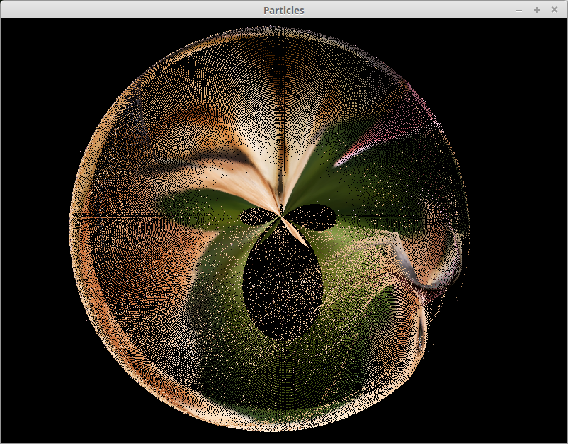
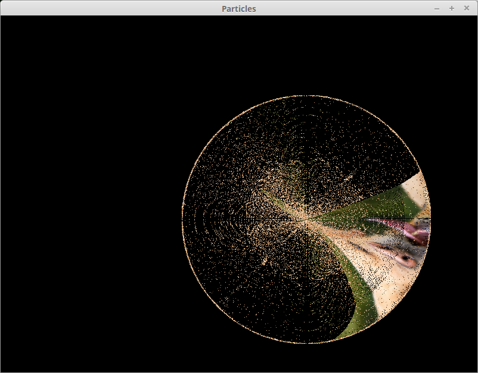
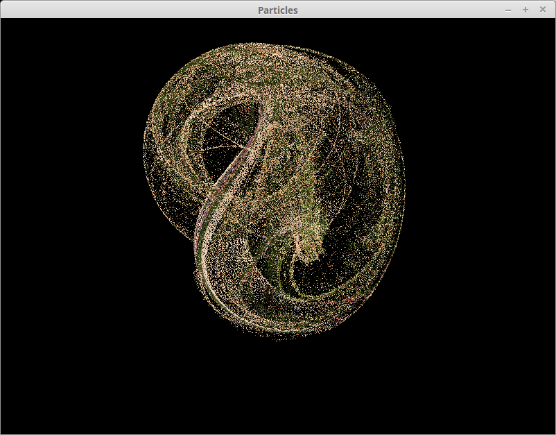

# particles-gpu
Particles system running on GPU using OpenGL shaders.

# Description
Particle system running on the GPU. An attracting point is controlled by the mouse: hold left button to activate it, move the mouse to move it.
Use A and E for zooming/dezooming, ZQSD for moving the camera.

Particles' positions and velocities are stored in textures. Each component is stored in 2 channels of a pixel (making it possible to store 65534 values).

The code used for updating velocities and positions and for displaying the particles is written in openGL GLSL language in two shaders: vertex and fragment shaders.

On my integrated Intel chip, I can run a simulation of 1 million particles in 60 fps.

# Screenshots

# Compiling
Developped under Linux using SFML 2.3.2 for OpenGL context creation and shaders management. Requires at least OpenGL 3.0.

A Makefile is placed at the root of the repository, expecting SFML, OpenGL, Glew and GLM to be installed on the machine.

